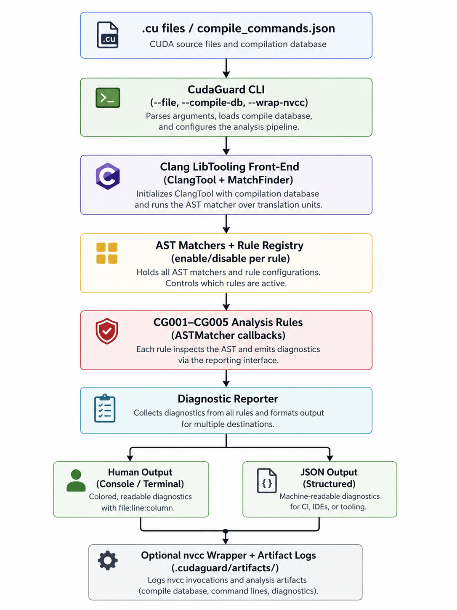

# CudaGuard

```text
  ____       _        ____                      _ 
 / ___| _  _| | __ _ / ___|_   _  __ _ _ __  __| |
| |   || | | | |/ _` | |  _| | | |/ _` | '__|/ _` |
| |___|| |_| | | (_| | |_| | |_| | (_| | |  | (_| |
 \____| \__,_|_|\__,_|\____|\__,_|\__,_|\___/ \__,_|
                                                  
```

[](https://en.cppreference.com/w/cpp/compiler_support/20)
[](https://clang.llvm.org/)
[](https://cmake.org/)
[](https://www.linux.org/)
[](https://github.com/google/googletest)
[](https://developer.nvidia.com/cuda-zone)
[](https://github.com/Dev228-afk/cudaguard/actions)
[](https://github.com/Dev228-afk/cudaguard/releases)

**A high-performance C++20 Clang LibTooling static analysis and compiler-driver diagnostics tool for CUDA C++.**

CudaGuard analyzes CUDA C++ source code **before compilation** and reports compiler-style diagnostics for common CUDA front-end and runtime-safety issues. It is a focused diagnostic layer that integrates with `compile_commands.json` and wraps `nvcc`.

---

## 🚀 Key Features

*   **Front-End Semantic Analysis**: Parses CUDA C++ source files using Clang LibTooling (no fragile regex parsing) to build a robust AST.
*   **Declarative AST Matchers**: Traverses the Clang AST using precise, declarative AST Matchers to inspect node hierarchies.
*   **CUDA Safety Rules**: Detects 5 common CUDA-specific programming bugs (launch configurations, synchronization, memory direction, host/device attributes).
*   **Rich Compiler-Style Diagnostics**: Reports issues with exact file/line/column coordinates, unique rule IDs, and compiler-like fix hints.
*   **Build Tooling Integration**: Outputs warnings as JSON for easy integration with IDEs/CI workflows, and can wrap `nvcc` directly.

---

## 📋 What It Does Not Do

*   Generate PTX, SASS, LLVM IR, or device code.
*   Replace `nvcc` or `clang++` (it acts as a diagnostic pre-pass).
*   Perform runtime profiling or performance optimization.

---

## 🏗️ Architecture
# CudaGuard 🛡️

A high-performance, compiler-level static analysis and diagnostics tool for CUDA C++ source code, built on C++20 and Clang LibTooling.

[](https://en.cppreference.com/w/cpp/20)
[](https://clang.llvm.org/)
[](https://developer.nvidia.com/cuda-zone)
[](LICENSE)

CudaGuard acts as a fast, pre-compilation diagnostic pass that inspects CUDA C++ source files before invoking `nvcc`. By leveraging **Clang LibTooling** and precise **Abstract Syntax Tree (AST) Matchers**, it bypasses fragile regex parsing to identify critical concurrency, memory safety, and kernel launch configuration bugs directly within your development workflow or CI/CD pipeline.

---

## 🚀 Key Features

* **Production-Grade Semantic Analysis:** Uses Clang LibTooling to construct a true Abstract Syntax Tree (AST) of CUDA source code.
* **Declarative AST Matchers:** Traverses deep node hierarchies with precision to spot subtle CUDA programming anti-patterns.
* **Targeted GPU Safety Rules:** Detects 5 high-impact, hard-to-debug CUDA issues, including synchronization errors and unsafe dynamic shared memory allocation.
* **Compiler-Style Diagnostics:** Outputs actionable warnings and error messages containing exact file, line, and column coordinates alongside clear resolution hints.
* **Seamless Build System Integration:** Integrates out of the box with `compile_commands.json` or wraps `nvcc` directly to stop broken builds early.

---

## 🏗️ Architecture

To see how CudaGuard integrates into your GPU compilation toolchain, see our design layout:



---

## 🔍 CUDA Static Analysis Rules & Diagnostics Reference

Expand any rule below to view the diagnostic logic, code examples, and compiler hints:

### 🛑 CG001: Missing CUDA Error Check After Kernel Launch (Warning)
* **Description:** Detects asynchronous CUDA kernel launches that are not followed by error checking blocks (`cudaGetLastError()`, `cudaPeekAtLastError()`, or `cudaDeviceSynchronize()`) within the trailing 5 statements.
* **Why it matters:** Kernel launches are non-blocking. Skipping error checks leads to untraceable runtime crashes and silent failures.

<details>
<summary>💻 Code Examples & Diagnostic Output</summary>

```cuda
// ❌ Bad Code
vectorAdd<<<blocks, threads>>>(d_a, d_b, d_c, n);
cudaFree(d_a); // Missing error checking logic!
return 0;

//  Good Code
vectorAdd<<<blocks, threads>>>(d_a, d_b, d_c, n);
cudaError_t err = cudaGetLastError();
if (err != cudaSuccess) {
    fprintf(stderr, "Kernel launch failed: %s\n", cudaGetErrorString(err));
    return 1;
}
---

## 🔍 Interactive Diagnostics Reference

Expand any rule below to see details, diagnostics, and code examples:

<details>
<summary><b>CG001: Missing CUDA Error Check After Kernel Launch (Warning)</b></summary>

### Description
Detects CUDA kernel launches that are not followed by a call to `cudaGetLastError()`, `cudaPeekAtLastError()`, or `cudaDeviceSynchronize()` within the next 5 statements.

### Why it matters
CUDA kernel launches are asynchronous. If a launch fails, the error state is lost unless checked. Omitting this check leads to silent runtime failures.

❌ **Bad Code**
```cuda
vectorAdd<<<blocks, threads>>>(d_a, d_b, d_c, n);
cudaFree(d_a);  // No error check!
return 0;
```

**Good Code**
```cuda
vectorAdd<<<blocks, threads>>>(d_a, d_b, d_c, n);
cudaError_t err = cudaGetLastError();
if (err != cudaSuccess) {
    fprintf(stderr, "Launch failed: %s\n", cudaGetErrorString(err));
    return 1;
}
```

⚠️ **Diagnostic**
```
file.cu:42:5: warning: CG001: kernel launch is not followed by cudaGetLastError, cudaPeekAtLastError, or cudaDeviceSynchronize
  hint: add cudaGetLastError() after the launch to catch asynchronous launch failures
```
</details>

<details>
<summary><b>CG002: Suspicious Kernel Launch Configuration (Warning)</b></summary>

### Description
Detects kernel launches with invalid literal dimensions:
*   Zero grid dimension: `kernel<<<0, N>>>(...)`
*   Zero block dimension: `kernel<<<N, 0>>>(...)`
*   Block size exceeding 1024 (hardware limit): `kernel<<<N, 2048>>>(...)`

### Why it matters
A zero dimension ensures no threads run. Block sizes above 1024 exceed the hardware limit of current CUDA devices, causing launch failures.

❌ **Bad Code**
```cuda
compute<<<4, 0>>>(data);         // Zero block size
compute<<<0, 256>>>(data);       // Zero grid size
compute<<<1, 2048>>>(data);      // Exceeds max block size (1024)
```

**Good Code**
```cuda
compute<<<4, 256>>>(data);       // Valid launch configuration
```

⚠️ **Diagnostic**
```
file.cu:18:5: warning: CG002: kernel launch uses a zero block dimension
  hint: block dimension should be positive; check thread-block calculation
```
</details>

<details>
<summary><b>CG003: Host/Device Qualifier Misuse (Error)</b></summary>

### Description
Detects when a `__device__` or `__global__` function directly calls a function that lacks `__device__` or `__host__ __device__` qualifiers.

### Why it matters
Functions called from device code must be compiled for the GPU. Calling a host-only function from device code is a compile error in nvcc.

❌ **Bad Code**
```cuda
void hostHelper(int x) { printf("%d\n", x); }

__device__ int compute(int x) {
    hostHelper(x);  // Error: host-only function called from device code
    return x * 2;
}
```

**Good Code**
```cuda
__host__ __device__ int sharedHelper(int x) { return x * 2; }

__device__ int compute(int x) {
    return sharedHelper(x);  // OK: qualified correctly
}
```

⚠️ **Diagnostic**
```
file.cu:27:5: error: CG003: __device__ function 'compute' calls function 'hostHelper' that is not marked __device__ or __host__ __device__
  hint: add __device__ or __host__ __device__ qualifier to 'hostHelper'
```
</details>

<details>
<summary><b>CG004: Unsafe Dynamic Shared Memory Usage (Warning)</b></summary>

### Description
Detects kernel launches where the kernel uses `extern __shared__` memory but the launch does not provide a dynamic shared-memory size (third launch parameter).

### Why it matters
When a kernel declares dynamic `extern __shared__` arrays, the size must be specified at launch time. Omitting it defaults to 0 bytes, leading to out-of-bounds memory corruption.

❌ **Bad Code**
```cuda
__global__ void kernel() {
    extern __shared__ float buf[];
    buf[threadIdx.x] = 1.0f;
}

kernel<<<blocks, threads>>>();  // Missing shared memory size!
```

**Good Code**
```cuda
kernel<<<blocks, threads, threads * sizeof(float)>>>();  // Correct
```

⚠️ **Diagnostic**
```
file.cu:33:5: warning: CG004: kernel 'kernel' uses extern __shared__ memory, but launch does not provide a dynamic shared-memory size
  hint: use the third kernel launch parameter to specify dynamic shared memory size
```
</details>

<details>
<summary><b>CG005: cudaMemcpy Direction Mismatch (Warning)</b></summary>

### Description
Detects `cudaMemcpy` calls where the direction argument does not match the allocated pointer locations (host vs. device) using intra-procedural pointer provenance.

### Why it matters
Passing the wrong direction to `cudaMemcpy` (e.g. copying from host to device but using `cudaMemcpyDeviceToHost`) causes undefined behavior and segmentation faults.

❌ **Bad Code**
```cuda
float* d_data;
cudaMalloc(&d_data, bytes);
float* h_data = (float*)malloc(bytes);

// Destination d_data is device, source h_data is host, but direction says DeviceToHost!
cudaMemcpy(d_data, h_data, bytes, cudaMemcpyDeviceToHost);
```

**Good Code**
```cuda
cudaMemcpy(d_data, h_data, bytes, cudaMemcpyHostToDevice); // Correct direction
```

⚠️ **Diagnostic**
```
file.cu:51:5: warning: CG005: cudaMemcpy direction may not match known pointer categories
  hint: destination 'd_data' was allocated with cudaMalloc (device), but copy direction is DeviceToHost
```
</details>

---

## 🛠️ Build and Setup

```bash
# Prerequisites (Ubuntu/Debian):
#   sudo apt install llvm-dev libclang-dev clang cmake g++

cmake -S . -B build -DCMAKE_EXPORT_COMPILE_COMMANDS=ON
cmake --build build
ctest --test-dir build
```


## Demo

<!-- After recording:  -->
<!-- Generate with: ./scripts/record_demo.sh -->

```bash
# One rule per file — immediate visual feedback:
./build/cudaguard --file examples/demo/bad_missing_error_check.cu -- -x cuda --cuda-gpu-arch=sm_75
./build/cudaguard --file examples/demo/bad_host_device_call.cu -- -x cuda --cuda-gpu-arch=sm_75
./build/cudaguard --file examples/demo/bad_shared_memory.cu -- -x cuda --cuda-gpu-arch=sm_75
./build/cudaguard --file examples/demo/bad_memcpy_direction.cu -- -x cuda --cuda-gpu-arch=sm_75

# Clean file — should produce 0 warnings:
./build/cudaguard --file examples/demo/good_vector_add.cu -- -x cuda --cuda-gpu-arch=sm_75

# JSON output:
./build/cudaguard --json --file examples/demo/bad_host_device_call.cu -- -x cuda --cuda-gpu-arch=sm_75

# Wrapper mode:
./build/cudaguard --wrap-nvcc -- nvcc -arch=sm_75 examples/vector_add.cu -o vector_add
```

## Testing

**40+ regression test cases across 5 rules** (positive, negative, and edge cases):

```bash
# Unit tests (GoogleTest)
ctest --test-dir build

# Regression tests (Python runner)
python3 scripts/run_regression_tests.py

# Overhead benchmark
python3 scripts/benchmark_overhead.py
```

See [docs/test_matrix.md](docs/test_matrix.md) for the full test case breakdown.

## Performance

CudaGuard analysis adds **<5% overhead** when used as a wrapper around `nvcc`:

```
File: examples/vector_add.cu
  nvcc compile time:        1.42s
  cudaguard analysis:       0.05s
  wrapper overhead:         3.5%
```

Measured via `scripts/benchmark_overhead.py`.

## CLI Reference

| Option | Description |
| -------- | ------------- |
| `--file <path>` | Analyze a single CUDA source file |
| `--compile-db <path>` | Load `compile_commands.json` |
| `--enable <rules>` | Enable only specified rules (e.g., `CG001,CG003`) |
| `--disable <rules>` | Disable specified rules |
| `--warnings-as-errors` | Promote all warnings to errors |
| `--json` | Emit diagnostics as JSON |
| `--wrap-nvcc` | Run checks before invoking nvcc; abort on errors |
| `--help, -h` | Show usage |
| `--version` | Print version |

## Project Structure

```
cudaguard/
├── CMakeLists.txt              # C++20, LLVM/Clang, GoogleTest
├── include/cudaguard/          # Public headers
│   ├── Diagnostics.h           # Reporter + formatters
│   ├── Rule.h                  # Rule interface
│   ├── RuleRegistry.h          # Rule management
│   ├── ToolConfig.h            # CLI config
│   ├── CompileDatabaseLoader.h # compile_commands.json support
│   ├── BuildWrapper.h          # nvcc wrapper
│   └── rules/                  # 5 rule headers
├── src/                        # Implementation
│   ├── main.cpp                # CLI entry point
│   └── rules/                  # 5 rule implementations
├── tests/
│   ├── unit/                   # GoogleTest (22+ assertions)
│   └── regression/             # 34 CUDA files (41+ cases)
├── examples/
│   ├── demo/                   # One clear file per rule
│   └── broken_examples/        # Multi-issue examples
├── scripts/
│   ├── run_regression_tests.py # Automated regression runner
│   ├── benchmark_overhead.py   # Performance measurement
│   ├── generate_compile_commands.sh
│   └── demo.sh
└── docs/
    ├── design.md               # Architecture & design decisions
    ├── diagnostic_rules.md     # Rule documentation
    ├── test_matrix.md          # 40+ test case breakdown
    ├── limitations.md          # Explicit scope constraints
    └── demo_script.md          # 2-minute demo walkthrough
```

## Limitations

Explicitly documented — see [docs/limitations.md](docs/limitations.md):

- Does not generate PTX, SASS, LLVM IR, or device code
- Does not replace nvcc or clang++
- Template-heavy code may produce incomplete diagnostics
- Macro-expanded launches may have limited source-location quality
- CG005 is heuristic and only warns on high-confidence cases
- Interprocedural analysis intentionally limited
- Runtime correctness remains the responsibility of CUDA tools

## CI / Verification

GitHub Actions validates on every push:

- C++20 build across LLVM 15/16/17
- Unit tests (GoogleTest)
- Regression tests (Python runner)
- CLI smoke tests

CUDA Toolkit is required for full local demo and wrapper benchmarking. CI validates core C++ build, diagnostic infrastructure, and source-level regression behavior where CUDA headers are available or mocked.

See [docs/verification.md](docs/verification.md) for clean-clone verification results.

## Documentation

- [Design Document](docs/design.md) — architecture, component diagram, design decisions
- [Diagnostic Rules](docs/diagnostic_rules.md) — detailed rule documentation with examples
- [Test Matrix](docs/test_matrix.md) — 40+ cases breakdown by rule
- [Limitations](docs/limitations.md) — explicit scope constraints
- [Verification](docs/verification.md) — clean-clone build verification
- [Interview Notes](docs/interview_notes.md) — architecture explanation and preparation
- [Demo Script](docs/demo_script.md) — 2-minute walkthrough with talking points

## License

MIT
